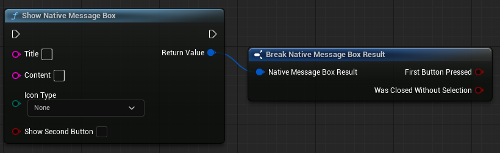
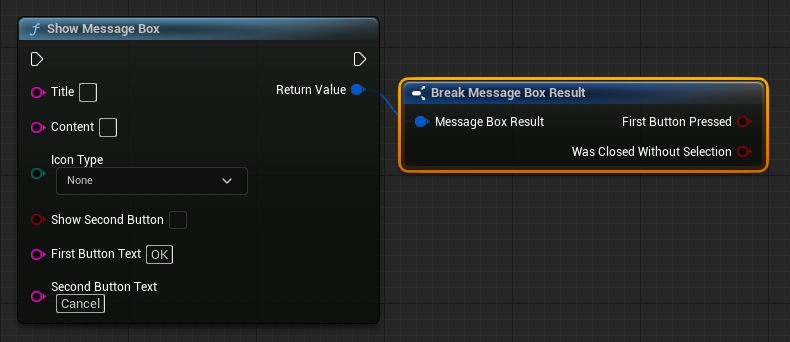

# 🖥️ Native Message Box (c++ & Blueprint)

This module provides a **native Windows message box** functionality for Unreal Engine projects, allowing developers to display custom **dialogs** with configurable **buttons**, **icons**, and **titles**.

## 📜 Features  
✅ Display customizable message boxes in Windows  
✅ Support for various icons (ℹ️ Info, ⚠️ Warning, ❌ Error, ❓ Question)  
✅ Configurable buttons with custom text  
✅ Detect which button was clicked or if the dialog was closed  

---

## 🛠️ Function: `ShowMessageBox`
### 📖 Description  
This function displays a Windows TaskDialog-based message box with customizable buttons, an icon, and a title.

### 📌 Parameters  
| Name              | Type            | Description |
|-------------------|----------------|-------------|
| `Title`          | `FString`       | The title of the message box |
| `Content`        | `FString`       | The main message displayed |
| `IconType`       | `EMessageBoxIcon` | The icon displayed in the message box (Info, Warning, Error, Question, None) |
| `bShowSecondButton` | `bool`       | Whether to show a second button |
| `FirstButtonText` | `FString`       | Text for the first button |
| `SecondButtonText` | `FString`       | Text for the second button (if enabled) |

### 🎯 Return Value  
Returns a `FMessageBoxResult` struct containing:  
- `bFirstButtonPressed` → `true` if the first button was clicked  
- `bWasClosedWithoutSelection` → `true` if the user closed the dialog without choosing an option  

---

## 🎨 Icon Types  
The `EMessageBoxIcon` enum defines the available icons:  

| Enum Value          | Description |
|--------------------|-------------|
| `Information` (ℹ️) | Displays an information icon |
| `Warning` (⚠️)    | Displays a warning icon |
| `Error` (❌)      | Displays an error icon |
| `Question` (❓)   | Displays no predefined icon |
| `None`            | No icon |

---

## 📝 Example Usage
```cpp
FMessageBoxResult Result = UMessageBoxWindows::ShowMessageBox(
    TEXT("Warning"),
    TEXT("Are you sure you want to delete this file?"),
    EMessageBoxIcon::Warning,
    true,
    TEXT("Yes"),
    TEXT("No")
);

if (Result.bFirstButtonPressed)
{
    // User clicked "Yes"
}
else if (!Result.bWasClosedWithoutSelection)
{
    // User clicked "No"
}
else
{
    // User closed the dialog without selecting
}
```
---

# Native Message Box In BluePrint


## 📌 Show Native Message Box

**Used to show an native Messag Box on windows, it has the option to enable 2 buttons yet you cant change buttons text, default is `Ok` & `Cancel`, the Return value can be splited or breaked to output an `First Button Pressed`
Boolean wich help developer to identify wich button player pressed.**




## 📜 Show Message Box

**Same as the first one but looks less native with the ability to modify the button text to anything you want.**
### 



